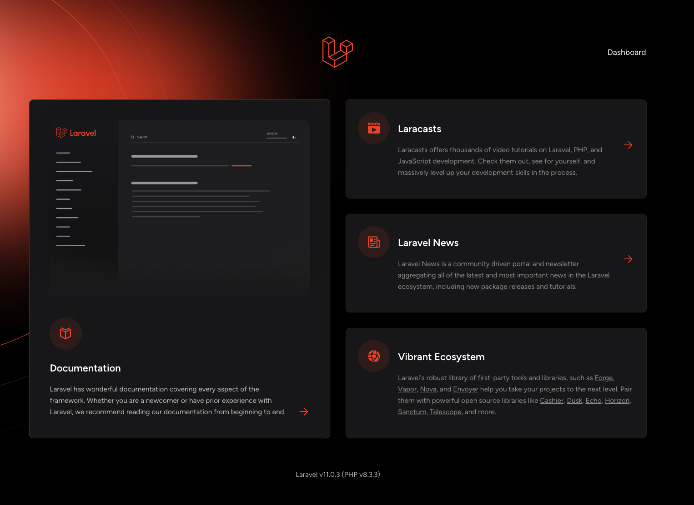
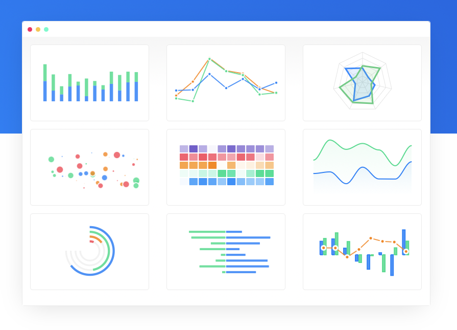
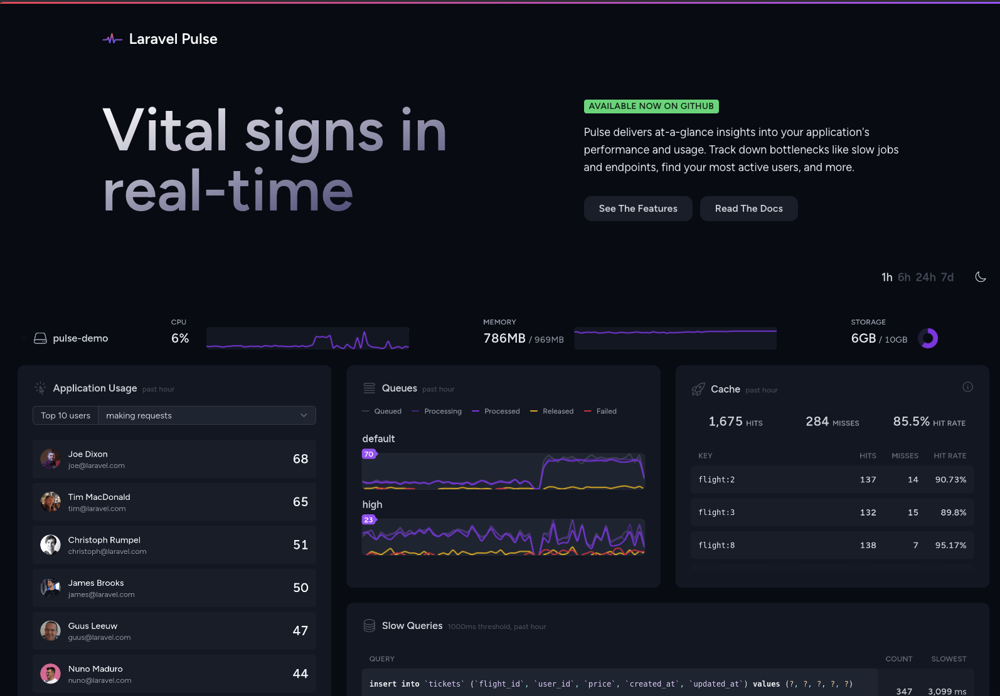
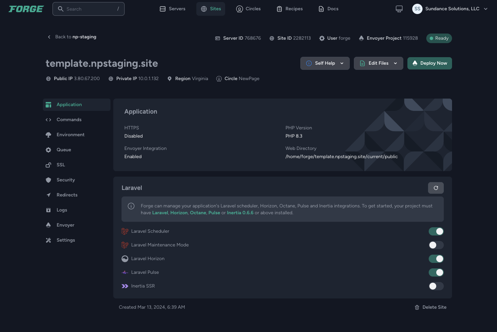

# Template Laravel Install


## Why

This will get any POC going quickly. It has the features needed for a solid proof of concept.



## What

### Deploy quickly and automatically
Using Github Actions

### Parallel Process and Scale as needed with Horizon Queues

### UI Charts and Dashboard with Interia JS
[https://inertiajs.com](https://inertiajs.com)

and 

[https://craftable.pro](https://craftable.pro)

## Charting with Apex Charts

[https://apexcharts.com](https://apexcharts.com)



## Team Manamagement and 2FA with JetStream

[https://jetstream.laravel.com/introduction.html](https://jetstream.laravel.com/introduction.html)


## How

### ENV Production
Using the Laravel docs [https://laravel.com/docs/10.x/configuration#encryption](https://laravel.com/docs/10.x/configuration#encryption)


## Local Setup
This is your typical Laravel install [https://laravel.com/docs/10.x/installation](https://laravel.com/docs/10.x/installation)
Since it uses Inertia you need to run `npm install` and then `npm dev` when working.


If you want to seed admin see `database/seeders/AdminSeeder`

```bash
php artisan db:seed --class=AdminSeeder
```

## Admin Dash
It is using [https://docs.craftable.pro/](https://docs.craftable.pro/)


## System Level info Pulse
`/pulse` you must be an admin user (more on that shortly)

[https://pulse.laravel.com/](https://pulse.laravel.com/)




## Queue System Horizon


## Forge on AWS

All of this is in Forge so we do not need to SSH or access the server




## Single Branch workflow

There is a lot to say here. I will link you to a few sources of information:

[https://www.youtube.com/watch?v=ASOSEiJCyEM&t=6s](https://www.youtube.com/watch?v=ASOSEiJCyEM&t=6s)

The research that backs a lot of this up: 

Books and papers linked in article below
[https://alfrednutile.info/ongoing-links-and-notes-about-devops-transformation-using-the-accelerate-data-and-strategies](https://alfrednutile.info/ongoing-links-and-notes-about-devops-transformation-using-the-accelerate-data-and-strategies)

Older Article that refrerences some good sources
[https://alfrednutile.info/feature-flags-in-laravel](https://alfrednutile.info/feature-flags-in-laravel)


### Feature Flag Library 
[https://laravel.com/docs/11.x/pennant](https://laravel.com/docs/11.x/pennant)

And some info on it [https://alfrednutile.info/using-laravel-pennant-in-inertia](https://alfrednutile.info/using-laravel-pennant-in-inertia)

