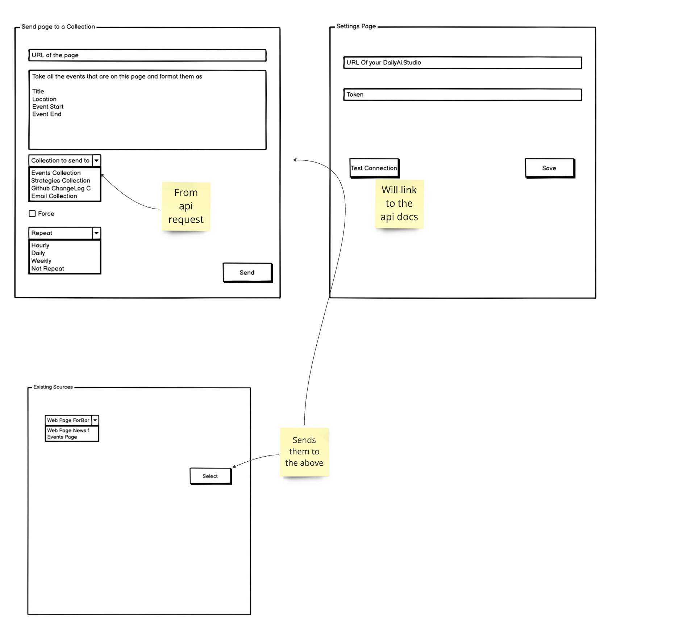

# Chrome Extension

This will help with the extension for the chrome browser.




### Authentication

This is standard Bearer Token authentication.

All requests have to have the following headers:

```curl 
curl --location 'https://[THEIR DAILYAI SERVER]/api/v1/collections' \
--header 'Authorization: Bearer <TOKEN>'
```


## GET Collections 

### Request 

```curl 
curl --location 'https://[THEIR DAILYAI SERVER]/api/v1/collections' \
--header 'Authorization: Bearer <TOKEN>'
```


### RESPONSE
```json 
{
    "current_page": 1,
    "data": [
        {
            "id": 62,
            "name": "Claude Testing Collection",
            "description": "Some details about your collection that will help give the ai system some context.",
            "active": true,
            "team_id": 1,
            "created_at": "2024-08-05T01:28:59.000000Z",
            "updated_at": "2024-08-05T01:28:59.000000Z",
            "driver": "claude",
            "embedding_driver": "ollama"
        },
        {
            "id": 22,
            "name": "CMS Content",
            "description": "These are webhooks from our CMS so we have all the data n one place and can provider output for editors and users of that site",
            "active": true,
            "team_id": 1,
            "created_at": "2024-06-10T10:16:16.000000Z",
            "updated_at": "2024-06-20T14:02:43.000000Z",
            "driver": "openai",
            "embedding_driver": "openai"
        },
        {
            "id": 24,
            "name": "Coding Standards",
            "description": "This is a collection of Coding Standards",
            "active": true,
            "team_id": 1,
            "created_at": "2024-06-12T14:27:20.000000Z",
            "updated_at": "2024-06-12T14:27:20.000000Z",
            "driver": "openai",
            "embedding_driver": "ollama"
        },
        {
            "id": 63,
            "name": "Content from FireCrawl",
            "description": "Some details about your collection that will help give the ai system some context.",
            "active": true,
            "team_id": 1,
            "created_at": "2024-08-05T23:59:43.000000Z",
            "updated_at": "2024-08-05T23:59:43.000000Z",
            "driver": "claude",
            "embedding_driver": "openai"
        },
        {
            "id": 34,
            "name": "CSV and Excel",
            "description": "Some details about your collection that will help give the ai system some context.",
            "active": true,
            "team_id": 1,
            "created_at": "2024-07-08T17:38:10.000000Z",
            "updated_at": "2024-07-08T17:38:10.000000Z",
            "driver": "ollama",
            "embedding_driver": "ollama"
        },
        {
            "id": 19,
            "name": "Customer Chat Bot",
            "description": "These are customer support emails that we will reply to and make a report out of",
            "active": true,
            "team_id": 1,
            "created_at": "2024-05-22T20:56:04.000000Z",
            "updated_at": "2024-06-07T14:04:45.000000Z",
            "driver": "openai",
            "embedding_driver": "ollama"
        },
        {
            "id": 53,
            "name": "Emails Sources",
            "description": "Some details about your collection that will help give the ai system some context.",
            "active": true,
            "team_id": 1,
            "created_at": "2024-07-24T11:46:25.000000Z",
            "updated_at": "2024-07-24T11:46:25.000000Z",
            "driver": "ollama",
            "embedding_driver": "openai"
        },
        {
            "id": 8,
            "name": "Example Collection with Filters",
            "description": "This will be an example collection to show the use of filters",
            "active": true,
            "team_id": 1,
            "created_at": "2024-05-05T12:42:58.000000Z",
            "updated_at": "2024-05-05T12:42:58.000000Z",
            "driver": "openai",
            "embedding_driver": "openai"
        },
        {
            "id": 1,
            "name": "Example Content",
            "description": "Some details about your collection that will help give the ai system some context.",
            "active": true,
            "team_id": 1,
            "created_at": "2024-04-25T01:01:04.000000Z",
            "updated_at": "2024-04-27T18:34:55.000000Z",
            "driver": "openai",
            "embedding_driver": "ollama"
        },
        {
            "id": 49,
            "name": "Firehouse Google Sheet",
            "description": "Some details about your collection that will help give the ai system some context.",
            "active": true,
            "team_id": 1,
            "created_at": "2024-07-11T10:49:40.000000Z",
            "updated_at": "2024-07-11T13:00:54.000000Z",
            "driver": "claude",
            "embedding_driver": "ollama"
        },
        {
            "id": 33,
            "name": "Firehouse SiteMap",
            "description": "Here is the site from the sitemap",
            "active": true,
            "team_id": 1,
            "created_at": "2024-07-07T17:46:37.000000Z",
            "updated_at": "2024-07-07T17:46:37.000000Z",
            "driver": "ollama",
            "embedding_driver": "ollama"
        },
        {
            "id": 26,
            "name": "Groq - Blogging Standards",
            "description": "These are some standards to help when blogging",
            "active": true,
            "team_id": 1,
            "created_at": "2024-06-14T00:29:29.000000Z",
            "updated_at": "2024-06-14T11:23:49.000000Z",
            "driver": "groq",
            "embedding_driver": "openai"
        },
        {
            "id": 46,
            "name": "Hospitable",
            "description": "Some details about your collection that will help give the ai system some context.",
            "active": true,
            "team_id": 1,
            "created_at": "2024-07-09T12:07:34.000000Z",
            "updated_at": "2024-07-09T12:07:34.000000Z",
            "driver": "ollama",
            "embedding_driver": "ollama"
        },
        {
            "id": 32,
            "name": "HR Data",
            "description": "HR Data",
            "active": true,
            "team_id": 1,
            "created_at": "2024-06-26T19:51:50.000000Z",
            "updated_at": "2024-07-07T12:41:34.000000Z",
            "driver": "ollama",
            "embedding_driver": "ollama"
        },
        {
            "id": 29,
            "name": "HR Email Response Collection",
            "description": "This is a collection of HR related data that can be used to reply to emails for level 1 support",
            "active": true,
            "team_id": 1,
            "created_at": "2024-06-17T20:29:21.000000Z",
            "updated_at": "2024-06-17T20:33:44.000000Z",
            "driver": "groq",
            "embedding_driver": "ollama"
        },
        {
            "id": 31,
            "name": "LaraLlama.io",
            "description": "News and Articles about LaraLlama",
            "active": true,
            "team_id": 1,
            "created_at": "2024-06-21T20:07:47.000000Z",
            "updated_at": "2024-07-05T18:47:35.000000Z",
            "driver": "ollama",
            "embedding_driver": "ollama"
        },
        {
            "id": 38,
            "name": "Large XLSX Import",
            "description": "Some details about your collection that will help give the ai system some context.",
            "active": true,
            "team_id": 1,
            "created_at": "2024-07-08T19:40:19.000000Z",
            "updated_at": "2024-07-08T19:40:19.000000Z",
            "driver": "ollama",
            "embedding_driver": "ollama"
        },
        {
            "id": 6,
            "name": "My Technology Presentation",
            "description": "This presentation emphasizes the importance of establishing a solid technological base to efficiently manage 90% of standard project needs, allowing teams to focus on the unique 10%. Drawing on extensive experience, including at Pfizer, it explores key practices like CI/CD from the outset, effective local development environments, and team-friendly tooling. Through real-world examples and strategies, the talk highlights how these foundations enhance productivity and adapt to various project challenges, paving the way for successful outcomes.",
            "active": true,
            "team_id": 1,
            "created_at": "2024-04-29T23:52:31.000000Z",
            "updated_at": "2024-05-08T11:49:20.000000Z",
            "driver": "ollama",
            "embedding_driver": "ollama"
        },
        {
            "id": 50,
            "name": "New Business RFIs",
            "description": "Some details about your collection that will help give the ai system some context.",
            "active": true,
            "team_id": 1,
            "created_at": "2024-07-11T14:46:34.000000Z",
            "updated_at": "2024-07-12T19:00:36.000000Z",
            "driver": "ollama",
            "embedding_driver": "ollama"
        },
        {
            "id": 7,
            "name": "News Feed about PHP and Laravel",
            "description": "This will be a news feed from the web about laravel and php",
            "active": true,
            "team_id": 1,
            "created_at": "2024-05-02T02:06:36.000000Z",
            "updated_at": "2024-05-02T02:06:36.000000Z",
            "driver": "groq",
            "embedding_driver": "openai"
        }
    ],
    "first_page_url": "https://[THEIR DAILYAI SERVER]/api/v1/collections?page=1",
    "from": 1,
    "last_page": 4,
    "last_page_url": "https://[THEIR DAILYAI SERVER]/api/v1/collections?page=4",
    "links": [
        {
            "url": null,
            "label": "&laquo; Previous",
            "active": false
        },
        {
            "url": "https://[THEIR DAILYAI SERVER]/api/v1/collections?page=1",
            "label": "1",
            "active": true
        },
        {
            "url": "https://[THEIR DAILYAI SERVER]/api/v1/collections?page=2",
            "label": "2",
            "active": false
        },
        {
            "url": "https://[THEIR DAILYAI SERVER]/api/v1/collections?page=3",
            "label": "3",
            "active": false
        },
        {
            "url": "https://[THEIR DAILYAI SERVER]/api/v1/collections?page=4",
            "label": "4",
            "active": false
        },
        {
            "url": "https://[THEIR DAILYAI SERVER]/api/v1/collections?page=2",
            "label": "Next &raquo;",
            "active": false
        }
    ],
    "next_page_url": "https://[THEIR DAILYAI SERVER]/api/v1/collections?page=2",
    "path": "https://[THEIR DAILYAI SERVER]/api/v1/collections",
    "per_page": 20,
    "prev_page_url": null,
    "to": 20,
    "total": 63
}
```

# POST Collections/Source 

## Request

```bash
curl --location 'https://[THEIR DAILYAI SERVER]/api/v1/collections/62/source' \
--header 'Content-Type: application/json' \
--header 'Authorization: ••••••' \
--data '{
    "url": "[THE URL THEY ARE GETTING DATA FROM]",
    "recurring": "not",
    "force": false,
    "prompt": "[THE PROMPT THEY WANT TO USE]",
    "content": "123456"
}'
```

# Get Sources

```bash
curl --location 'https://[THEIR DAILYAI SERVER]/api/v1/sources' \
--header 'Authorization: Bearer <TOKEN>'
```

```json
{
    "current_page": 1,
    "data": [
        {
            "id": 2,
            "title": "RAG Systems and Agents",
            "details": "RAG Systems and Agents",
            "collection_id": 9,
            "type": "web_search_source",
            "recurring": null,
            "last_run": "2024-05-08T13:17:36.000000Z",
            "meta_data": {
                "driver": "brave",
                "limit": 5,
                "api_key": "b4209754-ecd8-3ef6-a346-9bbef3203023"
            },
            "created_at": "2024-05-05T15:50:58.000000Z",
            "updated_at": "2024-05-08T13:17:36.000000Z",
            "active": true,
            "slug": null,
            "secrets": null,
            "deleted_at": null,
            "chat_id": null,
            "user_id": null,
            "force": false,
            "collection": {
                "id": 9,
                "name": "Search the web for PHP News",
                "description": "This collection will be a daily search of the web for PHP news",
                "active": true,
                "team_id": 1,
                "created_at": "2024-05-05T15:48:41.000000Z",
                "updated_at": "2024-05-08T14:04:11.000000Z",
                "driver": "ollama",
                "embedding_driver": "ollama"
            }
        },
        {
            "id": 3,
            "title": "Test",
            "details": "Test",
            "collection_id": 9,
            "type": "web_search_source",
            "recurring": null,
            "last_run": null,
            "meta_data": [],
            "created_at": "2024-05-07T02:28:42.000000Z",
            "updated_at": "2024-05-07T02:28:42.000000Z",
            "active": true,
            "slug": null,
            "secrets": null,
            "deleted_at": null,
            "chat_id": null,
            "user_id": null,
            "force": false,
            "collection": {
                "id": 9,
                "name": "Search the web for PHP News",
                "description": "This collection will be a daily search of the web for PHP news",
                "active": true,
                "team_id": 1,
                "created_at": "2024-05-05T15:48:41.000000Z",
                "updated_at": "2024-05-08T14:04:11.000000Z",
                "driver": "ollama",
                "embedding_driver": "ollama"
            }
        },
        {
            "id": 5,
            "title": "Search for devops news",
            "details": "news about the state of devops and the dora project",
            "collection_id": 13,
            "type": "web_search_source",
            "recurring": null,
            "last_run": "2024-05-11T13:26:22.000000Z",
            "meta_data": {
                "driver": "brave",
                "limit": 5
            },
            "created_at": "2024-05-11T13:26:18.000000Z",
            "updated_at": "2024-05-11T13:26:50.000000Z",
            "active": true,
            "slug": null,
            "secrets": null,
            "deleted_at": null,
            "chat_id": null,
            "user_id": null,
            "force": false,
            "collection": {
                "id": 13,
                "name": "State of Dev Ops",
                "description": "These reports are form the Dora project and will show the state of devops over the years.",
                "active": true,
                "team_id": 1,
                "created_at": "2024-05-11T11:02:38.000000Z",
                "updated_at": "2024-05-11T12:57:37.000000Z",
                "driver": "openai",
                "embedding_driver": "ollama"
            }
        },
        {
            "id": 6,
            "title": "Test Daily",
            "details": "Test daily",
            "collection_id": 17,
            "type": "web_search_source",
            "recurring": "half_hour",
            "last_run": "2024-05-19T17:10:31.000000Z",
            "meta_data": {
                "driver": "brave",
                "limit": 5
            },
            "created_at": "2024-05-19T17:10:31.000000Z",
            "updated_at": "2024-05-19T17:23:23.000000Z",
            "active": true,
            "slug": null,
            "secrets": null,
            "deleted_at": null,
            "chat_id": null,
            "user_id": null,
            "force": false,
            "collection": {
                "id": 17,
                "name": "Testing Updates 0.0.8",
                "description": "State of Devlops",
                "active": true,
                "team_id": 1,
                "created_at": "2024-05-18T14:19:16.000000Z",
                "updated_at": "2024-05-18T14:19:16.000000Z",
                "driver": "openai",
                "embedding_driver": "openai"
            }
        },
        {
            "id": 7,
            "title": "Ollama In The News",
            "details": "LLM News",
            "collection_id": 18,
            "type": "web_search_source",
            "recurring": "daily",
            "last_run": "2024-05-30T02:16:05.000000Z",
            "meta_data": {
                "driver": "brave",
                "limit": 5
            },
            "created_at": "2024-05-20T00:51:03.000000Z",
            "updated_at": "2024-05-30T02:16:05.000000Z",
            "active": true,
            "slug": null,
            "secrets": null,
            "deleted_at": null,
            "chat_id": null,
            "user_id": null,
            "force": false,
            "collection": {
                "id": 18,
                "name": "Web Searches",
                "description": "Laravel Related news",
                "active": true,
                "team_id": 1,
                "created_at": "2024-05-20T00:50:43.000000Z",
                "updated_at": "2024-05-28T00:37:51.000000Z",
                "driver": "ollama",
                "embedding_driver": "ollama"
            }
        },
        {
            "id": 12,
            "title": "Forward",
            "details": "test",
            "collection_id": 16,
            "type": "email_source",
            "recurring": "not",
            "last_run": null,
            "meta_data": [],
            "created_at": "2024-05-30T16:55:15.000000Z",
            "updated_at": "2024-05-30T16:55:15.000000Z",
            "active": true,
            "slug": "wmCVbcnsniKP",
            "secrets": null,
            "deleted_at": null,
            "chat_id": null,
            "user_id": null,
            "force": false,
            "collection": {
                "id": 16,
                "name": "State of DevOps Reports",
                "description": "These are the state of devops reports from the DORA project that span over a couple of years.",
                "active": true,
                "team_id": 1,
                "created_at": "2024-05-15T11:01:03.000000Z",
                "updated_at": "2024-05-31T14:42:25.000000Z",
                "driver": "openai",
                "embedding_driver": "ollama"
            }
        },
        {
            "id": 16,
            "title": "List of Support Instructions",
            "details": "Original Support Corpus as JSON",
            "collection_id": 19,
            "type": "json_source",
            "recurring": "not",
            "last_run": null,
            "meta_data": [
                "To create a new document in Microsoft Word, start by opening the Word application. Click on 'File' in the top left corner and select 'New'. You can choose a blank document or select from a variety of templates. Once your document is open, you can begin typing your content.",
                "Editing text in Word is straightforward. Simply click where you want to edit in the document and start typing. You can select text by clicking and dragging your mouse over the desired section. Use the 'Home' tab to find tools for cutting, copying, and pasting text, as well as changing fonts and text size.",
                "Saving your document is crucial to ensure your work is not lost. Click on 'File' and then 'Save As' to choose a location on your computer or cloud storage. Give your document a name and select the file format you prefer, such as .docx or .pdf. To save changes to an existing document, simply click 'Save' or press 'Ctrl+S' on your keyboard.",
                "To change the font of your text, first select the text you want to modify. Go to the 'Home' tab and find the 'Font' group. Here, you can choose from a variety of fonts, change the font size, and add effects like bold, italic, or underline. You can also change the color of the text using the 'Font Color' button.",
                "Adding images to your Word document can enhance its visual appeal. To insert an image, click on the 'Insert' tab and then select 'Pictures'. Choose whether to insert a picture from your computer or an online source. Once the image is inserted, you can resize it by clicking and dragging the corners, and you can adjust its position using the 'Layout Options'.",
                "To create a table in your document, navigate to the 'Insert' tab and click on 'Table'. You can then drag to select the number of rows and columns you need. Once the table is inserted, you can type directly into the cells and format the table using the 'Table Tools' that appear.",
                "To add a header or footer to your document, go to the 'Insert' tab and click on 'Header' or 'Footer'. You can choose from a variety of built-in styles or create your own custom header or footer. This is useful for adding page numbers, dates, or other document information.",
                "Changing the page orientation can be done by going to the 'Layout' tab and clicking on 'Orientation'. You can choose either 'Portrait' or 'Landscape'. This is useful when you want to change the way your document is presented, especially for wider content like tables or images.",
                "To use the spell check feature, go to the 'Review' tab and click on 'Spelling & Grammar'. Word will scan your document for spelling and grammar errors and suggest corrections. You can choose to accept or ignore each suggestion, helping to ensure your document is error-free.",
                "Adding bullet points or numbered lists can organize your text. Select the text you want to format, then go to the 'Home' tab. Click on the 'Bullets' or 'Numbering' buttons in the 'Paragraph' group to apply the desired list format.",
                "To insert a hyperlink, select the text or object you want to turn into a link. Then, go to the 'Insert' tab and click on 'Hyperlink'. You can enter the URL you want to link to or choose to link to another place in the document. This is helpful for creating references or connecting related content.",
                "To adjust line spacing in your document, select the text you want to format. Go to the 'Home' tab, then click on the 'Line and Paragraph Spacing' button in the 'Paragraph' group. You can choose from various spacing options or set custom spacing.",
                "To track changes in your document, go to the 'Review' tab and click on 'Track Changes'. This feature highlights edits made to the document, making it easier to see what changes have been made. You can also add comments by selecting text and clicking 'New Comment'.",
                "To find and replace text, go to the 'Home' tab and click on 'Replace' in the 'Editing' group. In the 'Find and Replace' dialog box, enter the text you want to find and the text you want to replace it with. Click 'Replace All' to make all changes at once.",
                "To format text as a heading, select the text you want to style. Go to the 'Home' tab and choose a heading style from the 'Styles' group. Using headings helps structure your document and makes it easier to navigate.",
                "To create a table of contents, first apply heading styles to the text you want to include. Then, go to the 'References' tab and click on 'Table of Contents'. Choose a style from the list, and Word will automatically generate a table of contents based on your headings.",
                "To insert a footnote, click where you want the footnote to appear. Go to the 'References' tab and click on 'Insert Footnote'. Word will add a superscript number in the text and a corresponding number at the bottom of the page where you can type your footnote.",
                "To create a macro, go to the 'View' tab and click on 'Macros', then 'Record Macro'. You can name your macro and assign it to a button or keyboard shortcut. Perform the actions you want to record, then click 'Stop Recording'. Macros can automate repetitive tasks.",
                "To use the mail merge feature, go to the 'Mailings' tab and click on 'Start Mail Merge'. Choose the type of document you want to create, such as letters or labels. Follow the prompts to select your recipients and insert merge fields. This is useful for sending personalized documents to multiple recipients.",
                "To protect your document, go to the 'File' tab and click on 'Info'. Then, click 'Protect Document' and choose an option, such as 'Encrypt with Password' or 'Restrict Editing'. This helps keep your document secure and controls who can make changes."
            ],
            "created_at": "2024-06-06T23:42:20.000000Z",
            "updated_at": "2024-06-07T10:35:30.000000Z",
            "active": true,
            "slug": "KBhOR3i5P0SMU1t4",
            "secrets": [],
            "deleted_at": null,
            "chat_id": null,
            "user_id": null,
            "force": false,
            "collection": {
                "id": 19,
                "name": "Customer Chat Bot",
                "description": "These are customer support emails that we will reply to and make a report out of",
                "active": true,
                "team_id": 1,
                "created_at": "2024-05-22T20:56:04.000000Z",
                "updated_at": "2024-06-07T14:04:45.000000Z",
                "driver": "openai",
                "embedding_driver": "ollama"
            }
        },
        {
            "id": 21,
            "title": "Test",
            "details": "The following content is from an email. I would like you to summarize it with the following format.\n\nTo: **TO HERE**\nFrom: **From Here**\nSubject: **Subject Here**\nBody:\n**Summary Here**\n\n\n** CONTEXT IS BELOW THIS LINE**\n[CONTEXT]",
            "collection_id": 20,
            "type": "email_box_source",
            "recurring": "not",
            "last_run": null,
            "meta_data": [],
            "created_at": "2024-06-09T11:49:29.000000Z",
            "updated_at": "2024-06-09T11:49:29.000000Z",
            "active": true,
            "slug": "aRr3z6o2g0n1",
            "secrets": {
                "username": "bob@bobsburgers.com",
                "password": "password",
                "host": "mail.bobsburgers.com",
                "port": 993,
                "protocol": "imap",
                "encryption": "ssl",
                "delete": true,
                "email_box": "Inbox"
            },
            "deleted_at": null,
            "chat_id": null,
            "user_id": null,
            "force": false,
            "collection": {
                "id": 20,
                "name": "Pull Requests around Documentation",
                "description": "These are pull requests related to our team docs",
                "active": true,
                "team_id": 1,
                "created_at": "2024-06-01T00:56:28.000000Z",
                "updated_at": "2024-06-02T11:29:31.000000Z",
                "driver": "openai",
                "embedding_driver": "ollama"
            }
        },
        {
            "id": 22,
            "title": "Test",
            "details": "Your Task is to take the fields requested below out of this encoded JSON and return it to the user as the format requested with no surrounding text.\n\nPlease take the data from the keys which might be an array and return\nas an array of json:\n\n## Keys to use for the Output:\ncommits.*.id\ncommits.*.message\ncommits.*.author.name\ncommits.*.timestamp\n## END KEYS TO USE\n\n## Format You will return the data as will be as follows and ONLY as follows, do not wrap response in ```json ```:\n[\n  {\n    \"commit_id\": \"1f32c2e9e6b8f29206c1b6e72c5f3a85b35c7087\",\n    \"message\": \"Update README.md by Bob Belcher on 2024-06-01 12:34\"\n  },\n   {\n    \"commit_id\": \"1f32c2e9e6b8f29206c1b6e72c5f3a85b35c7084\",\n    \"message\": \"Update Controller FooBar by Bob Belcher on 2024-06-03 12:34\"\n  }\n]\n## END FORMAT\n\n**Context from the database search of emails for used context**:\n[CONTEXT]",
            "collection_id": 20,
            "type": "webhook_source",
            "recurring": "not",
            "last_run": null,
            "meta_data": [],
            "created_at": "2024-06-09T11:50:46.000000Z",
            "updated_at": "2024-06-09T11:50:46.000000Z",
            "active": true,
            "slug": "BDxw1vVQbmhpRApT",
            "secrets": {
                "token": null
            },
            "deleted_at": null,
            "chat_id": null,
            "user_id": null,
            "force": false,
            "collection": {
                "id": 20,
                "name": "Pull Requests around Documentation",
                "description": "These are pull requests related to our team docs",
                "active": true,
                "team_id": 1,
                "created_at": "2024-06-01T00:56:28.000000Z",
                "updated_at": "2024-06-02T11:29:31.000000Z",
                "driver": "openai",
                "embedding_driver": "ollama"
            }
        },
        {
            "id": 23,
            "title": "Test",
            "details": "Test",
            "collection_id": 20,
            "type": "json_source",
            "recurring": "not",
            "last_run": null,
            "meta_data": [
                "Test"
            ],
            "created_at": "2024-06-09T11:54:48.000000Z",
            "updated_at": "2024-06-09T11:54:48.000000Z",
            "active": true,
            "slug": "1v99rW1m68knI65u",
            "secrets": [],
            "deleted_at": null,
            "chat_id": null,
            "user_id": null,
            "force": false,
            "collection": {
                "id": 20,
                "name": "Pull Requests around Documentation",
                "description": "These are pull requests related to our team docs",
                "active": true,
                "team_id": 1,
                "created_at": "2024-06-01T00:56:28.000000Z",
                "updated_at": "2024-06-02T11:29:31.000000Z",
                "driver": "openai",
                "embedding_driver": "ollama"
            }
        },
        {
            "id": 24,
            "title": "Test",
            "details": "GenAI News",
            "collection_id": 20,
            "type": "web_search_source",
            "recurring": "not",
            "last_run": null,
            "meta_data": {
                "driver": "brave",
                "limit": 5
            },
            "created_at": "2024-06-09T11:57:23.000000Z",
            "updated_at": "2024-06-09T11:57:23.000000Z",
            "active": true,
            "slug": "argIHfHQQzKs",
            "secrets": null,
            "deleted_at": null,
            "chat_id": null,
            "user_id": null,
            "force": false,
            "collection": {
                "id": 20,
                "name": "Pull Requests around Documentation",
                "description": "These are pull requests related to our team docs",
                "active": true,
                "team_id": 1,
                "created_at": "2024-06-01T00:56:28.000000Z",
                "updated_at": "2024-06-02T11:29:31.000000Z",
                "driver": "openai",
                "embedding_driver": "ollama"
            }
        },
        {
            "id": 25,
            "title": "CMS Webhooks",
            "details": "**ROLE**\nYou are getting JSON from a webhook and converting it to plain text for the user\n\n**TASK**\nConvert the JSON output it as TEXT. There are numerous objects under the article key in the JSON and all of them that are type:text need to be made into the body of the article. Here are the keys I want and the:\n```\ntitle\nupdated_at\nuri\nslug\narticle..*.text\n```\n**Format Output**\nThis is the format I want you to return as just simple text:\n```output\nTitle:\nUri:\nSlug:\nBody:\n[all the article.type = text keys and values]\n```\n\n### BELOW IS THE CONTEXT###\n[CONTEXT]",
            "collection_id": 22,
            "type": "webhook_source",
            "recurring": "not",
            "last_run": null,
            "meta_data": [],
            "created_at": "2024-06-10T10:16:40.000000Z",
            "updated_at": "2024-06-10T11:03:04.000000Z",
            "active": true,
            "slug": "y5tpdcdMtqzjny9Z",
            "secrets": {
                "token": "ys2tlf86h7mfbehoc5ywzth1wvzfti24"
            },
            "deleted_at": null,
            "chat_id": null,
            "user_id": null,
            "force": false,
            "collection": {
                "id": 22,
                "name": "CMS Content",
                "description": "These are webhooks from our CMS so we have all the data n one place and can provider output for editors and users of that site",
                "active": true,
                "team_id": 1,
                "created_at": "2024-06-10T10:16:16.000000Z",
                "updated_at": "2024-06-20T14:02:43.000000Z",
                "driver": "openai",
                "embedding_driver": "openai"
            }
        },
        {
            "id": 26,
            "title": "Larallama.io feed",
            "details": "**Role**\nYou are an assistant that can take web and or plain text and save the content\n\n**Task**\nPull the title, summary and content from the content and save it to the database\n\n**Format**\nMarkdown as follows:\nTitle: Title Here\nSummary: Summary Here\nContent: Content Here\nDate: Date Here\nUrl: Url Here\n\n[CONTEXT]",
            "collection_id": 22,
            "type": "feed_source",
            "recurring": "not",
            "last_run": "2024-06-10T16:09:09.000000Z",
            "meta_data": {
                "feed_url": "http://www.larallama.io/feed"
            },
            "created_at": "2024-06-10T15:50:28.000000Z",
            "updated_at": "2024-06-10T16:09:09.000000Z",
            "active": true,
            "slug": "L5RDbaYaQ3yK",
            "secrets": null,
            "deleted_at": null,
            "chat_id": null,
            "user_id": null,
            "force": false,
            "collection": {
                "id": 22,
                "name": "CMS Content",
                "description": "These are webhooks from our CMS so we have all the data n one place and can provider output for editors and users of that site",
                "active": true,
                "team_id": 1,
                "created_at": "2024-06-10T10:16:16.000000Z",
                "updated_at": "2024-06-20T14:02:43.000000Z",
                "driver": "openai",
                "embedding_driver": "openai"
            }
        },
        {
            "id": 27,
            "title": "Get Data from urls",
            "details": "**Role**\nYou are an assistant that can take a we page and reduce it to down to text\n\n**Task**\nWhen you are giving text from a webpage pull the important areas out like H1, H2, H3, H4, H5, H6, Paragraphs, Lists, Tables, Images, Videos, Links, and any other important information.\n\n**Format**\nMarkdown as follows:\nTitle: Title Here\nDescription: Summary Here\nContent:\nContent Here including tables etc\nLink: Link Here\n\n** Web Page Content Below**\n[CONTEXT]",
            "collection_id": 28,
            "type": "web_page_source",
            "recurring": "not",
            "last_run": null,
            "meta_data": {
                "urls": "https://larallama.io/posts/numerous-ui-updates-prompt-template-improvements-and-more\nhttps://docs.larallama.io/developing.html"
            },
            "created_at": "2024-06-17T00:37:45.000000Z",
            "updated_at": "2024-06-17T00:37:45.000000Z",
            "active": true,
            "slug": "z50fHSEh8Uzs",
            "secrets": null,
            "deleted_at": null,
            "chat_id": null,
            "user_id": null,
            "force": false,
            "collection": {
                "id": 28,
                "name": "Testing new UI",
                "description": "Some details about your collection that will help give the ai system some context.",
                "active": true,
                "team_id": 1,
                "created_at": "2024-06-14T17:57:14.000000Z",
                "updated_at": "2024-06-14T17:57:14.000000Z",
                "driver": "openai",
                "embedding_driver": "ollama"
            }
        },
        {
            "id": 28,
            "title": "Ollama News",
            "details": "Ollama",
            "collection_id": 28,
            "type": "web_search_source",
            "recurring": "daily",
            "last_run": "2024-06-17T12:11:21.000000Z",
            "meta_data": {
                "driver": "brave",
                "limit": 5
            },
            "created_at": "2024-06-17T12:11:16.000000Z",
            "updated_at": "2024-06-17T12:36:47.000000Z",
            "active": true,
            "slug": "itGgHQP2QF8p",
            "secrets": null,
            "deleted_at": null,
            "chat_id": null,
            "user_id": null,
            "force": false,
            "collection": {
                "id": 28,
                "name": "Testing new UI",
                "description": "Some details about your collection that will help give the ai system some context.",
                "active": true,
                "team_id": 1,
                "created_at": "2024-06-14T17:57:14.000000Z",
                "updated_at": "2024-06-14T17:57:14.000000Z",
                "driver": "openai",
                "embedding_driver": "ollama"
            }
        },
        {
            "id": 29,
            "title": "Pull in Data from my CMS",
            "details": "**Role**\nYou are an assistant that can take web and or plain text and save the content\n\n**Task**\nPull the title, summary and content from the content and save it to the database\n\n**Format**\nMarkdown as follows:\nTitle: Title Here\nDescription: Summary Here\nContent: Content Here\nDate: Date Here\nLink: Link Here\nCategory: Link Here\n\n[CONTEXT]",
            "collection_id": 31,
            "type": "feed_source",
            "recurring": "not",
            "last_run": "2024-07-04T11:04:56.000000Z",
            "meta_data": {
                "feed_url": "https://www.larallama.io/feed"
            },
            "created_at": "2024-06-21T20:08:25.000000Z",
            "updated_at": "2024-07-04T11:04:56.000000Z",
            "active": true,
            "slug": "jthLYTMsCEDU",
            "secrets": null,
            "deleted_at": null,
            "chat_id": null,
            "user_id": null,
            "force": false,
            "collection": {
                "id": 31,
                "name": "LaraLlama.io",
                "description": "News and Articles about LaraLlama",
                "active": true,
                "team_id": 1,
                "created_at": "2024-06-21T20:07:47.000000Z",
                "updated_at": "2024-07-05T18:47:35.000000Z",
                "driver": "ollama",
                "embedding_driver": "ollama"
            }
        },
        {
            "id": 30,
            "title": "Sitemap",
            "details": "**Role**\nYou are an assistant that can take web and or plain text and save the content\n\n**Task**\nPull the title, summary and content from the content and save it to the database\n\n**Format**\nMarkdown as follows:\nTitle: Title Here\nDescription: Summary Here\nContent: Content Here\nDate: Date Here\nLink: Link Here\nCategory: Link Here\n\n[CONTEXT]",
            "collection_id": 33,
            "type": "site_map_source",
            "recurring": "not",
            "last_run": "2024-07-07T20:34:28.000000Z",
            "meta_data": {
                "feed_url": "https://firehouse.agency/sitemap.xml"
            },
            "created_at": "2024-07-07T18:45:50.000000Z",
            "updated_at": "2024-07-07T20:34:28.000000Z",
            "active": true,
            "slug": "E3A94hQzPrIg",
            "secrets": null,
            "deleted_at": null,
            "chat_id": null,
            "user_id": null,
            "force": false,
            "collection": {
                "id": 33,
                "name": "Firehouse SiteMap",
                "description": "Here is the site from the sitemap",
                "active": true,
                "team_id": 1,
                "created_at": "2024-07-07T17:46:37.000000Z",
                "updated_at": "2024-07-07T17:46:37.000000Z",
                "driver": "ollama",
                "embedding_driver": "ollama"
            }
        },
        {
            "id": 31,
            "title": "Test Emails Source",
            "details": "Test",
            "collection_id": 33,
            "type": "email_source",
            "recurring": "not",
            "last_run": "2024-07-07T19:20:36.000000Z",
            "meta_data": [],
            "created_at": "2024-07-07T19:09:16.000000Z",
            "updated_at": "2024-07-07T19:20:36.000000Z",
            "active": true,
            "slug": "aJzo9BJcEBA7",
            "secrets": null,
            "deleted_at": null,
            "chat_id": null,
            "user_id": null,
            "force": false,
            "collection": {
                "id": 33,
                "name": "Firehouse SiteMap",
                "description": "Here is the site from the sitemap",
                "active": true,
                "team_id": 1,
                "created_at": "2024-07-07T17:46:37.000000Z",
                "updated_at": "2024-07-07T17:46:37.000000Z",
                "driver": "ollama",
                "embedding_driver": "ollama"
            }
        },
        {
            "id": 32,
            "title": "Example Search Source",
            "details": "Taco Cabana",
            "collection_id": 33,
            "type": "web_search_source",
            "recurring": "not",
            "last_run": "2024-07-07T20:29:44.000000Z",
            "meta_data": {
                "driver": "brave",
                "limit": 5
            },
            "created_at": "2024-07-07T20:29:39.000000Z",
            "updated_at": "2024-07-07T20:29:44.000000Z",
            "active": true,
            "slug": "zbKVWWGlrA9L",
            "secrets": null,
            "deleted_at": null,
            "chat_id": null,
            "user_id": null,
            "force": false,
            "collection": {
                "id": 33,
                "name": "Firehouse SiteMap",
                "description": "Here is the site from the sitemap",
                "active": true,
                "team_id": 1,
                "created_at": "2024-07-07T17:46:37.000000Z",
                "updated_at": "2024-07-07T17:46:37.000000Z",
                "driver": "ollama",
                "embedding_driver": "ollama"
            }
        },
        {
            "id": 33,
            "title": "test",
            "details": "**Role**\nYou are an assistant that can take a we page and reduce it to down to text\n\n**Task**\nWhen you are giving text from a webpage pull the important areas out like H1, H2, H3, H4, H5, H6, Paragraphs, Lists, Tables, Images, Videos, Links, and any other important information.\n\n**Format**\nMarkdown as follows:\nTitle: Title Here\nDescription: Summary Here\nContent:\nContent Here including tables etc\nLink: Link Here\n\n** Web Page Content Below**\n[CONTEXT]",
            "collection_id": 45,
            "type": "web_page_source",
            "recurring": "not",
            "last_run": null,
            "meta_data": {
                "urls": "https://larallama.io/posts"
            },
            "created_at": "2024-07-09T00:11:17.000000Z",
            "updated_at": "2024-07-09T00:11:17.000000Z",
            "active": true,
            "slug": "1OMWQNZ99sqO",
            "secrets": null,
            "deleted_at": null,
            "chat_id": null,
            "user_id": null,
            "force": false,
            "collection": {
                "id": 45,
                "name": "Tet 007",
                "description": "This is a CSV file",
                "active": true,
                "team_id": 1,
                "created_at": "2024-07-08T23:59:20.000000Z",
                "updated_at": "2024-07-08T23:59:20.000000Z",
                "driver": "ollama",
                "embedding_driver": "ollama"
            }
        }
    ],
    "first_page_url": "https://[THEIR DAILYAI SERVER]/api/v1/sources?page=1",
    "from": 1,
    "last_page": 3,
    "last_page_url": "https://[THEIR DAILYAI SERVER]/api/v1/sources?page=3",
    "links": [
        {
            "url": null,
            "label": "&laquo; Previous",
            "active": false
        },
        {
            "url": "https://[THEIR DAILYAI SERVER]/api/v1/sources?page=1",
            "label": "1",
            "active": true
        },
        {
            "url": "https://[THEIR DAILYAI SERVER]/api/v1/sources?page=2",
            "label": "2",
            "active": false
        },
        {
            "url": "https://[THEIR DAILYAI SERVER]/api/v1/sources?page=3",
            "label": "3",
            "active": false
        },
        {
            "url": "https://[THEIR DAILYAI SERVER]/api/v1/sources?page=2",
            "label": "Next &raquo;",
            "active": false
        }
    ],
    "next_page_url": "https://[THEIR DAILYAI SERVER]/api/v1/sources?page=2",
    "path": "https://[THEIR DAILYAI SERVER]/api/v1/sources",
    "per_page": 20,
    "prev_page_url": null,
    "to": 20,
    "total": 45
}
```

# GET Collections/Source

## Request

```bash
curl --location 'https://[THEIR DAILYAI SERVER]/api/v1/collections/9/sources/2' \
--header 'Authorization: Bearer <TOKEN>'
```

## RESPONSE

```json
{
    "id": 2,
    "title": "RAG Systems and Agents",
    "prompt": "RAG Systems and Agents",
    "active": true,
    "recurring": null,
    "force": false,
    "status": "non needed",
    "type": "web_search_source",
    "collection_id": 9,
    "url": null
}
```


